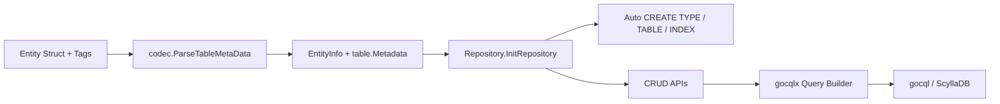

# gocqlx-orm

[](https://go.dev/)
[](https://pkg.go.dev/github.com/saivnct/gocqlx-orm)
[](#testing)

`gocqlx-orm` is an opinionated ORM extension for ScyllaDB and Cassandra on top of [`scylladb/gocqlx`](https://github.com/scylladb/gocqlx).

It reduces repetitive schema and CRUD boilerplate by deriving table metadata directly from Go structs and tags.

## Why gocqlx-orm

- **Schema bootstrap from entities**: auto-create tables, indexes, and UDTs (`IF NOT EXISTS`)
- **Consistent mapping**: one source of truth for Go fields, CQL columns, and key definitions
- **Practical repository layer**: reusable CRUD and query helpers with pagination and filtering support
- **Advanced type support**: nested UDTs, collection of UDTs, and tuple columns

## Core Features

- Auto create table from model metadata
- Auto create secondary indexes from tags
- Auto create UDTs (including nested dependencies)
- Base repository for common CRUD operations:
  - `Save`, `SaveMany`
  - `SaveWithTTL`, `SaveManyWithTTL`
  - `FindAll`, `Find`, `FindByPrimaryKey`, `FindByPartitionKey`, `FindWithOption`
  - `CountAll`, `Count`
  - `DeleteAll`, `DeleteByPrimaryKey`, `DeleteByPartitionKey`

## Installation

```bash
go get github.com/saivnct/gocqlx-orm@latest
```

## Quick Start

### 1. Define an entity

```go
type Person struct {
    ID        gocql.UUID `db:"id" pk:"1"`
    FirstName string     `db:"first_name" index:"true"`
    LastName  string     `db:"last_name" pk:"2"`
    Email     string     `db:"email" index:"true"`
    CreatedAt time.Time  `db:"created_at" ck:"1"`
}

func (Person) TableName() string {
    return "person"
}
```

### 2. Create a session

```go
cluster := gocql.NewCluster(hosts...)
session, err := gocqlx.WrapSession(cluster.CreateSession())
if err != nil {
    log.Fatal(err)
}
defer session.Close()
```

### 3. Create a repository

```go
type PersonRepository struct {
    cqlxoRepository.BaseScyllaRepository
}

func NewPersonRepository(session gocqlx.Session) (*PersonRepository, error) {
    d := &PersonRepository{}
    if err := d.InitRepository(session, Person{}); err != nil {
        return nil, err
    }
    return d, nil
}
```

### 4. Use CRUD methods

```go
personRepository, err := NewPersonRepository(session)
if err != nil {
    log.Fatal(err)
}

err = personRepository.Save(Person{
    ID:        gocql.TimeUUID(),
    FirstName: "Ada",
    LastName:  "Lovelace",
    Email:     "ada@example.com",
    CreatedAt: time.Now(),
})
```

### 5. Save with TTL (expiration)

TTL values are in **seconds** (CQL `USING TTL` unit):

```go
// expires after 1 hour
err = personRepository.SaveWithTTL(person, 3600)

// expires after 10 minutes
err = personRepository.SaveManyWithTTL([]cqlxoEntity.BaseScyllaEntityInterface{
    person1, person2,
}, 600)
```

TTL validation behavior:

- `ttl <= 0` returns `cqlxoRepository.InvalidTTL`
- TTL is applied per written row using `INSERT ... USING TTL ?`

### 6. Configure Batch Save Behavior

`SaveMany` and `SaveManyWithTTL` use CQL batch execution with safe defaults:

- default chunk size: `50`
- default batch type: `gocql.UnloggedBatch`

You can override this per repository:

```go
personRepository.SetBatchSaveConfig(cqlxoRepository.BatchSaveConfig{
    ChunkSize: 100,
    Type:      gocql.LoggedBatch,
})
```

Fallback rules:

- `ChunkSize <= 0` falls back to `50`
- unsupported batch type falls back to `gocql.UnloggedBatch`

#### Batch Type Selection Guide

`BatchSaveConfig.Type` accepts:

- `gocql.UnloggedBatch` (default)
- `gocql.LoggedBatch`
- `gocql.CounterBatch`

Choose batch type based on your write pattern:

- `gocql.UnloggedBatch`: best default for most `SaveMany` workloads where rows are independent. Lower coordinator overhead than logged batches.
- `gocql.LoggedBatch`: use when you need atomicity across multiple statements in the same batch (all-or-nothing semantics). This has higher overhead.
- `gocql.CounterBatch`: use only for counter table updates.

Practical guidance:

- Prefer small chunk sizes even with batches; very large batches can hurt performance.
- For ordinary bulk insert/update of non-counter data, start with `UnloggedBatch`.
- Switch to `LoggedBatch` only when atomic multi-statement behavior is required.

## Architecture



## Struct Tags

`gocqlx-orm` reads metadata from struct tags:

- `db`: column name (optional). Defaults to `CamelToSnakeASCII(fieldName)`.
- `pk`: partition key order (required for primary-key columns).
- `ck`: clustering key order (optional).
- `index`: set to `"true"` to auto-create a secondary index.
- `dbType`: explicit CQL type (optional). If omitted, inferred from Go type.

## Supported Type Mapping

In addition to primitive and collection types, the library supports:

- **UDT columns**
- **Nested UDT fields**
- **Collections of UDTs** (for example, `[]MyUDT`)
- **Tuple columns**
- **Byte array/blob columns** (for example, `[]byte`)

### UDT Example

```go
type Address struct {
    gocqlx.UDT
    Street string `db:"street"`
    City   string `db:"city"`
    Zip    int    `db:"zip"`
}

type DeliveryProfile struct {
    gocqlx.UDT
    PrimaryAddress Address   `db:"primary_address"`
    AddressHistory []Address `db:"address_history"`
}
```

### Tuple Example

```go
type Coordinate struct {
    Lat float64 `db:"lat"`
    Lng float64 `db:"lng"`
}

func (Coordinate) Tuple() string {
    return "coordinate"
}
```

## Query Options (Pagination / Sorting)

`FindWithOption` supports:

- `AllowFiltering`
- `Page` / `ItemsPerPage`
- `OrderBy` / `Order`

Use it for page-by-page reads while preserving repository-level mapping.

## Examples

Integration examples are available under `test/`:

- `test/01_example_test.go`
- `test/02_example_test.go`
- `test/03_example_test.go`
- `test/04_example_test.go`
- `test/05_example_test.go`
- `test/06_example_test.go` (byte array / blob + TTL)

## Testing

The integration tests use [testcontainers-go](https://github.com/testcontainers/testcontainers-go) with ScyllaDB containers.

Run all tests:

```bash
go test ./...
```

Run focused integration examples:

```bash
go test ./test -run TestExample04_NestedUDT_SliceUDT_Tuple -count=1
```

## Performance and Benchmarks

This project targets developer productivity first, while keeping runtime overhead low by delegating query execution to `gocqlx` / `gocql`.

For your workload, benchmark with your own schema and consistency profile:

```bash
go test ./... -run '^$' -bench . -benchmem
```

Recommended benchmark dimensions:

- single-row insert/read latency (`Save`, `FindByPrimaryKey`)
- bulk insert throughput (`SaveMany`, `SaveManyWithTTL`)
- paginated read latency (`FindWithOption`)
- impact of indexed vs non-indexed predicates
- impact of nested UDT / tuple payload size

## Migration from Plain gocqlx

If you currently use `gocqlx` directly, migration is incremental:

1. Keep your existing cluster/session setup.
2. Add entity structs with ORM tags (`db`, `pk`, `ck`, `index`, `dbType`).
3. Create a repository per entity embedding `cqlxoRepository.BaseScyllaRepository`.
4. Replace hand-written bootstrap DDL with `InitRepository(...)`.
5. Move common CRUD queries to repository methods (`Save`, `Find*`, `Count*`, `Delete*`).
6. Keep complex custom CQL where needed; repository usage does not block direct session access.

Before/after pattern:

```go
// Before (plain gocqlx): manual schema + hand-written query wiring.
// After (gocqlx-orm): schema bootstrap + reusable repository from entity metadata.
```

## Project Scope

This library is focused on pragmatic schema-first ORM support for Scylla/Cassandra applications that want:

- low ceremony data access,
- explicit struct-based modeling,
- and fast startup with automatic schema bootstrap.

## Contributing

Issues and pull requests are welcome.

When contributing:

- include tests for behavior changes,
- keep APIs backward compatible where possible,
- and prefer clear, explicit mappings over hidden magic.

## License

License file is not included yet. Add `LICENSE` to the repository root to enable license badge and package metadata visibility.
